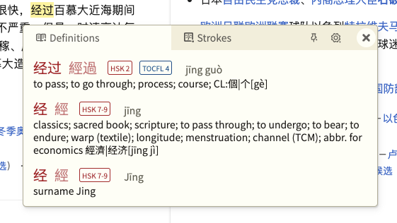
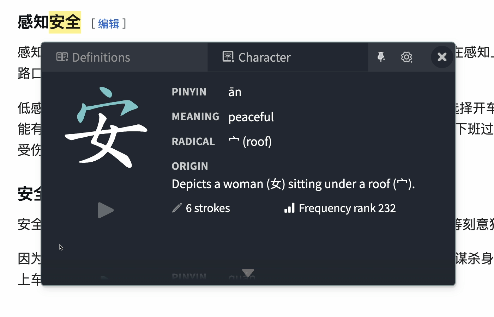
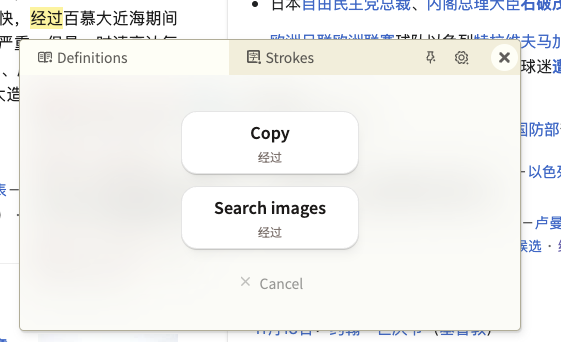
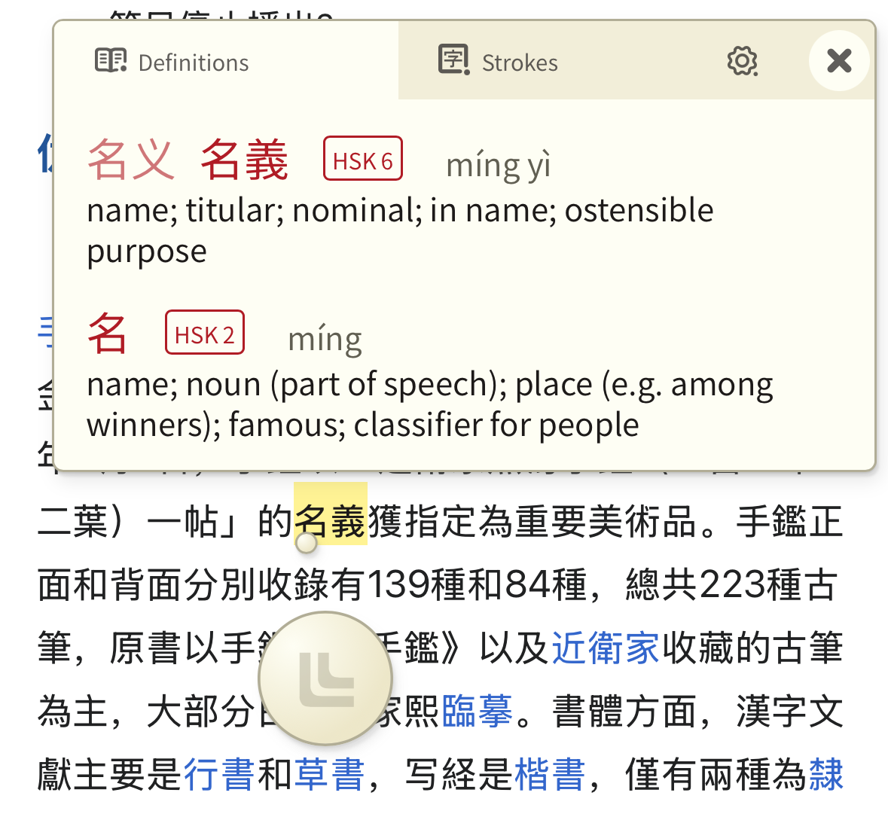

<div align="center">
  <p>
    
    <h1>LingLook</h1>
  </p>
</div>


## Table of Contents

- [Introduction](#introduction)
- [Installation](#installation)
- [Features](#features)
- [Screenshots](#screenshots)
- [How to use](#how-to-use)
- [Codebase state](#codebase-state)
- [Building from source](#building-from-source)
- [Contributing](#contributing)
- [Data sources](#data-sources)
- [Credits](#credits)
- [License](#license)

## Introduction

LingLook is a browser extension that lets you look up Chinese words by hovering over them. It works on Chromium based browsers, Firefox (desktop and Android version), Safari (macOS and iOS).

## Installation

- [Chrome Extension](https://chromewebstore.google.com/detail/linglook/iokfkfickldinmejhpfcngiocoedkpkh)
- [App Store](https://apps.apple.com/app/linglook/id6738310788) (macOS and iOS Safari Extension App)
- [Firefox Add-on](https://addons.mozilla.org/firefox/addon/linglook/)
- [Edge Add-on](https://microsoftedge.microsoft.com/addons/detail/hmfcnlmcekaglkfokhajekokgojpeidk)

## Features

- Look up Chinese words by hovering over them, on both desktop and mobile.
- Supports both simplified and traditional Chinese characters.
- Displays the word's definition, pinyin, HSK level, TOCFL level.
- Detailed character information: stroke order animation, frequency, radical, origin, etc.
- Copy the word to clipboard.
- Search the word with Google Images.
- Supports keyboard shortcuts for desktop users.
- Customize the extension's appearance and behavior through the settings page.
- Supports English and Vietnamese dictionaries.
- (For Vietnamese learners only) Displays the word's Sino-Vietnamese transliteration (phiên âm Hán Việt).

## Screenshots

#### On desktop

<div align="center">
  
  <br>
  
  <br>
  
</div>

#### On mobile

<div align="center">
  
</div>

## How to use

- Enable the extension in your browser. Pin it to your toolbar for easy access.
  - You can click on the extension icon to enable/disable the popup function.
- On desktop, use the mouse to hover over a Chinese word, the popup window will appear.
- On mobile devices, there is a circular puck on the screen. Move that puck to hover over the target word and the popup window will appear.
  - Single-tap on the puck to temporarily disable/enable the lookup function.
  - Double-tap on the puck to switch the lookup direction between up and down.
- Inside the popup window, you can see the word's definition, pinyin, HSK level, TOCFL level.
  - Click on the word, and you can copy it to clipboard or search it with Google Images.
- Switch to the "Character" tab, here you can play stroke order animation and see other character information like frequency, radical, origin, etc.
- Clicking on the Settings gear icon will open the extension's settings page. Here you can change various settings including theme, show/hide HSK/TOCFL levels, simplified/traditional character order, dictionary language, keyboard shortcuts, etc.
- Troubleshooting: If for some reason the extension does not work as expected, try enabling/disabling the extension, reloading the page, or restarting the browser.

## Codebase state

All functions are working as intended. However, for now, the codebase still contains unused code from the original project (10ten), making it much more complex than necessary. Some components have been repurposed but still retain their original names. For details, check [notes.md](notes.md).

## Building from source

```bash
pnpm install --frozen-lockfile

# For Chrome/Chromium browsers
pnpm build:chrome
# Load the `dist-chrome` folder as an unpacked extension in chrome://extensions

# For Firefox
pnpm build:firefox
# Load the `dist-firefox` folder temporarily via about:debugging

# For Safari
pnpm build:safari
# 1. Open the Xcode project in the `xcode13` folder
# 2. Select your target device (iOS/macOS)
# 3. Build and run the project through Xcode
```

## Contributing

Contributions are welcome! Please feel free to submit a Pull Request or an Issue to suggest improvements or report bugs.

## Data sources

- Dictionary definition data:
  - [Chinese-English dictionary data](data/cedict_en.u8): [CC-CEDICT](https://www.mdbg.net/chinese/dictionary?page=cedict) by MDBG, licensed under the [Creative Commons Attribution-ShareAlike 4.0 International License](https://creativecommons.org/licenses/by-sa/4.0/)
  - [Chinese-Vietnamese dictionary data](data/cedict_vi.u8): [CVDICT](https://github.com/ph0ngp/CVDICT) by Phong Phan, licensed under the [Creative Commons Attribution-ShareAlike 4.0 International License](https://creativecommons.org/licenses/by-sa/4.0/)
  - [Chinese-French dictionary data](data/cedict_fr.u8): [CFDICT](https://chine.in/mandarin/dictionnaire/CFDICT/) by Chine Informations under the [Creative Commons Attribution-ShareAlike 3.0 Unported](https://creativecommons.org/licenses/by-sa/3.0/)
- Chinese character data:
  - [English version](data/char_en.txt): originally from [Dong Chinese Character Wiki](https://www.dong-chinese.com/wiki) by Peter Olson, edited by Phong Phan, licensed under the [Creative Commons Attribution-ShareAlike 4.0 International License](https://creativecommons.org/licenses/by-sa/4.0/)
  - [Vietnamese version](data/char_vi.txt): translated and edited by Phong Phan from the original source of Dong Chinese data, licensed under the [Creative Commons Attribution-ShareAlike 4.0 International License](https://creativecommons.org/licenses/by-sa/4.0/)
  - Note: to see the format of these files, refer to [notes.md](notes.md).
- Chinese character stroke order data: [Hanzi Writer project](https://hanziwriter.org) by David Chanin, licensed under the [MIT License](https://hanziwriter.org/license.html)
- Sino-Vietnamese transliteration data: [Hán-Việt Pinyin wordlist](https://github.com/ph0ngp/hanviet-pinyin-wordlist) by Phong Phan, licensed under the [MIT License](https://github.com/ph0ngp/hanviet-pinyin-wordlist/blob/main/LICENSE)

## Credits

This project started as a fork of the [10ten Japanese Reader](https://github.com/birchill/10ten-ja-reader) project. So, huge thanks to the author [@birtles](https://github.com/birtles) for his wonderful work. It has served as the perfect cross-platform base for LingLook. I recommend anyone who is learning Japanese to check out his project.

## License

The included data sources are licensed as specified in the [Data sources](#data-sources) section.

The remaining part of the software is licensed under the [GNU General Public License v3.0](LICENSE) by [Phong Phan](https://github.com/ph0ngp).
