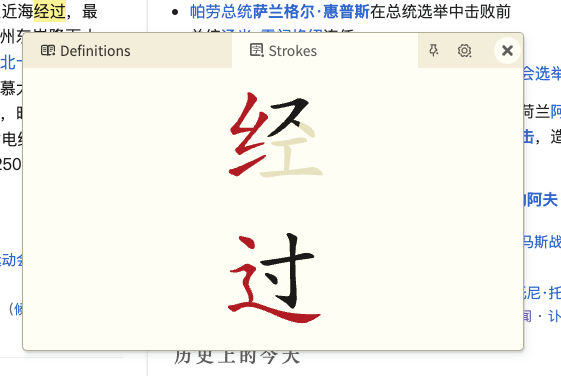

<div align="center">
  <p>
    
    <br>
    
    <h1>LingLook</h1>
  </p>
</div>

## Introduction

LingLook is a browser extension that lets you look up Chinese words by hovering over them. It works on Chromium based browsers, Firefox (desktop and Android version), Safari (macOS and iOS). It's a fork of [10ten Japanese Reader](https://github.com/birchill/10ten-ja-reader).

## Screenshots

#### On desktop

<div align="center">
  
  <br>
  
</div>

#### On mobile

<div align="center">
  
</div>

## How to use

- Enable the extension in your browser. Pin it to your toolbar for easy access.
  - You can click on the extension icon to enable/disable the popup function.
- On desktop, use the mouse to hover over a Chinese word, the popup window will appear.
- On mobile devices, there is a circular puck on the screen. Move that puck to hover over the target word and the popup window will appear.
- Inside the popup window, you can see the word's meaning, pinyin, HSK level, TOCFL level.
  - Click on the word, and you can copy it to clipboard or search it with Google Images.
- In the "Strokes" tab, click on a character to see its stroke order.
- Clicking on the Settings gear icon will open the extension's settings page. Here you can change its theme, show/hide HSK/TOCFL levels, choose your simplified/traditional character order, change the dictionary language, change the extension shortcuts, etc.
- Troubleshooting: If for some reason the extension doesn't work as expected, try enabling/disabling the extension or reloading the page or restarting the browser.

## Codebase state

Every function is working as intended. However, the current codebase still has many parts from the original project (10ten), even though unused, which makes the code more bloated and messy than needed. Hopefully it will be trimmed up with time. Some parts are used for new purposes but still keep the original names. For detail check [notes.md](notes.md).

## Building from source

```bash
pnpm install --frozen-lockfile

# For Chrome/Chromium browsers
pnpm build:chrome
# Load the `dist-chrome` folder as an unpacked extension in chrome://extensions

# For Firefox
pnpm build:firefox
# Load the `dist-firefox` folder temporarily via about:debugging

# For Safari
pnpm build:safari
# 1. Open the Xcode project in the `xcode13` folder
# 2. Select your target device (iOS/macOS)
# 3. Build and run the project through Xcode
```

## Contributing

Contributions are welcome! Please feel free to submit a Pull Request or an Issue to suggest improvements or report bugs.

## Data sources

- Chinese-English dictionary data: [CC-CEDICT](https://www.mdbg.net/chinese/dictionary?page=cedict) by MDBG, licensed under the [Creative Commons Attribution-ShareAlike 4.0 International License](https://creativecommons.org/licenses/by-sa/4.0/)
- Chinese-Vietnamese dictionary data: [CVDICT](https://github.com/ph0ngp/CVDICT) by Phong Phan, licensed under the [Creative Commons Attribution-ShareAlike 4.0 International License](https://creativecommons.org/licenses/by-sa/4.0/)
- Chinese character stroke order data: [Hanzi Writer project](https://hanziwriter.org) by David Chanin, licensed under the [MIT License](https://hanziwriter.org/license.html)
- Sino-Vietnamese transliteration data: [Hán-Việt Pinyin wordlist](https://github.com/ph0ngp/hanviet-pinyin-wordlist) by Phong Phan, licensed under the [MIT License](https://github.com/ph0ngp/hanviet-pinyin-wordlist/blob/main/LICENSE)

## License

This software is licensed under the [GNU General Public License v3.0](LICENSE) by [Phong Phan](https://github.com/ph0ngp).